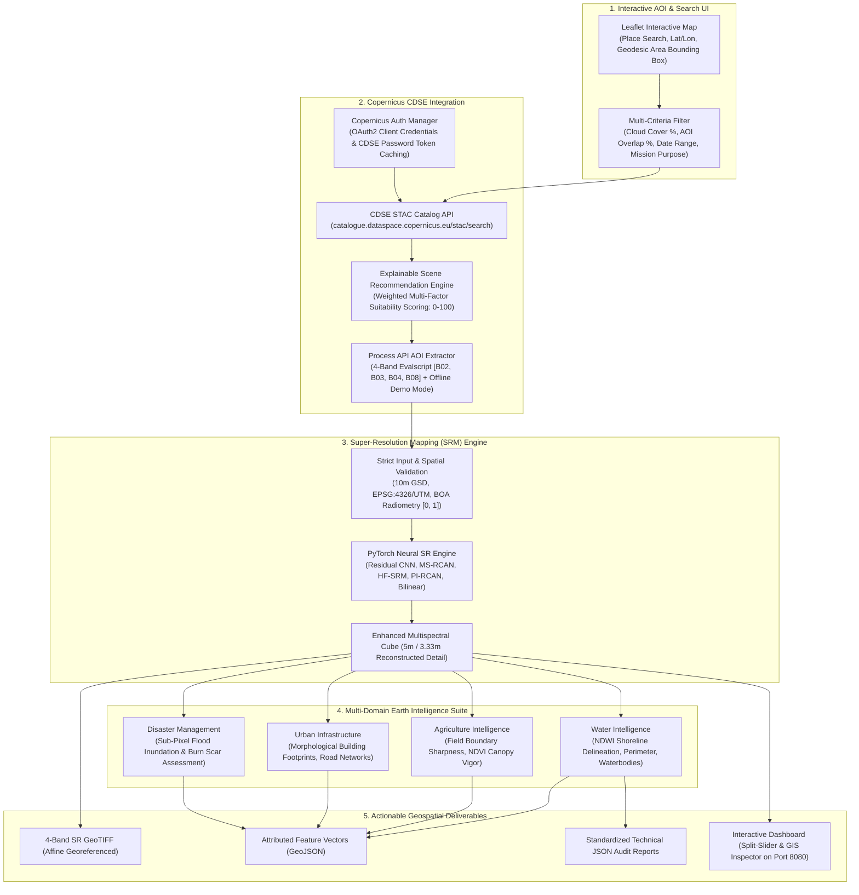

# TERRA-SR: AOI-Driven Satellite Earth Intelligence & Super-Resolution Platform

[](https://www.python.org/)
[](https://pytorch.org/)
[](https://dataspace.copernicus.eu/)
[](https://www.sih.gov.in/)
[]()

An end-to-end, deep learning-powered satellite earth observation and geospatial intelligence platform developed for **Smart India Hackathon (SIH 2026)** — *Problem Statement SIH26142: Deep Learning Based Super Resolution Mapping (SRM) from Medium Resolution Satellite Imageries*.

TERRA-SR enables users to interactively define an **Area of Interest (AOI)** anywhere on Earth, search and filter the **Copernicus Data Space Ecosystem (CDSE)** catalog for optimal Sentinel-2 L2A scenes, automatically retrieve calibrated 4-band BOA multispectral data (`B02 Blue`, `B03 Green`, `B04 Red`, `B08 NIR`), super-resolve medium resolution (10m GSD) imagery to **5m / 3.33m GSD** using physics-informed neural networks, and execute operational downstream intelligence across **Water**, **Agriculture**, **Urban Infrastructure**, and **Disaster Assessment**.

---

## 1. End-to-End System Architecture



---

## 2. Technology Stack & Frameworks

| Category | Technologies / Libraries | Purpose |
| :--- | :--- | :--- |
| **Deep Learning** | `PyTorch 2.1+`, `torchvision`, `CUDA` | Super-resolution neural networks (PI-RCAN, HF-SRM, MS-RCAN, Residual CNN, ESPCN), custom composite physics loss functions, sub-pixel convolutions, tensor pipelines. |
| **Geospatial Processing** | `rasterio`, `geopandas`, `shapely`, `fiona`, `pyproj`, `affine` | Reading/writing multi-band GeoTIFFs, UTM/WGS84 reprojections (`EPSG:32643`), affine geotransforms, vector polygonization. |
| **Data Science & CV** | `numpy`, `scipy`, `matplotlib`, `PIL`, `opencv-python-headless` | Spectral index mathematics, Fourier frequency analysis, GLCM spatial texture, edge gradient computation, visualization generation. |
| **Cloud Remote Sensing** | `requests`, `python-dotenv`, Copernicus Data Space API, Planet API | Automated search, authentication, and ingestion of Sentinel-2 L2A tiles and high-resolution PlanetScope scenes. |
| **Interactive Web Platform** | Vanilla HTML5, Modern CSS (Glassmorphism), JavaScript (ES6+), Python HTTP Server | High-performance interactive dashboard (`app/satellite_enhancer.py`) running on `localhost:8080` with split-slider view, zoom inspection, spectral profiles, and GeoTIFF downloads. |
| **Configuration & Specs** | `PyYAML`, `json`, GitHub Flavored Markdown | Modular experiment configurations, sensor degradation specifications, and quality control auditing rules. |

---

## 3. Deep Learning Models & Architecture Matrix

```
+───────────────────────────────────────────────────────────────────────────────────────────────────────────────────+
|                                             MODEL ARCHITECTURE MATRIX                                             |
+──────────────────────────+─────────────────+───────────────+───────────────────────────+──────────────────────────+
| Model Name               | Paradigm        | Parameters    | Loss Formulation          | Purpose / Target GSD     |
+──────────────────────────+─────────────────+───────────────+───────────────────────────+──────────────────────────+
| **Bilinear**             | Analytical      | 0             | Non-learned               | Fixed baseline benchmark |
| **ESPCN (Exp 1)**        | Sub-Pixel CNN   | 28,996        | MSE ($L_2$)               | Fast sub-pixel feature   |
|                          |                 |               |                           | upscaling (5.0m GSD)     |
| **Residual CNN (Exp 3)** | Deep Residual   | 61,092        | MSE ($L_2$)               | Residual skip connection |
|                          |                 |               |                           | baseline (5.0m GSD)      |
| **MS-RCAN (Exp 4D)**     | Residual-in-    | 621,501       | Charbonnier + SSIM        | Deep cross-channel       |
|                          | Residual (RIR)  |               | + SAM + Edge Gradient     | attention (5.0m GSD)     |
| **HF-SRM (Exp 4E)**      | High-Frequency  | 425,760       | Charbonnier + Laplacian   | Multi-scale RF + NIR     |
|                          | Residual Attn   |               | + SAM + NDVI Consistency  | edge guidance (5.0m GSD) |
| **PI-RCAN (Exp 4F)**     | Physically      | 715,696       | Multi-Objective Physics   | Dual-head reflectance +  |
|                          | Informed RCAN   |               | + Heteroscedastic NLL     | uncertainty (5.0m GSD)   |
| **PI-RCAN Multi-Scale**  | Multi-Scale     | 807,984       | Composite Physics Loss    | Direct sub-4m product    |
| **(Experiment 5)**       | PixelShuffle    |               | + 10-Gate QC Audit        | (3.33m / 2.5m Target GSD)|
| **U-Net ResNet-34**      | Semantic        | ~21,300,000   | Focal Loss + Soft Dice    | Downstream marine slick   |
|                          | Segmentation    |               |                           | boundary extraction      |
+──────────────────────────+─────────────────+───────────────+───────────────────────────+──────────────────────────+
```

---

## 4. Rigorous Benchmark Results (Held-Out Test Set)

### 4.1 6-Way Super-Resolution Model Comparison (Scale x2: 10m -> 5.0m)

*Evaluation Script:* `evaluate_6way_benchmark.py` | *Data:* 96 Held-Out Test Patches ($128\times 128$)

| Metric | Bilinear Baseline | ESPCN (Exp 1) | Residual CNN (Exp 3) | MS-RCAN (Exp 4D) | HF-SRM (Exp 4E) | PI-RCAN (Exp 4F) | Target Reference |
| :--- | :---: | :---: | :---: | :---: | :---: | :---: | :---: |
| **Trainable Params** | 0 | 28,996 | 61,092 | 621,501 | 425,760 | **715,696** | — |
| **Peak SNR (PSNR)** | 37.83 dB | 39.72 dB | **40.09 dB** | 39.95 dB | 39.47 dB | 37.28 dB | $+\infty$ |
| **MAE (Reflectance)** | 0.00924 | 0.00753 | **0.00719** | 0.00728 | 0.00772 | 0.00998 | 0.0000 |
| **RMSE** | 0.01334 | 0.01072 | **0.01025** | 0.01044 | 0.01103 | 0.01406 | 0.0000 |
| **Spectral Angle (SAM)**| 1.38° | 1.22° | **1.19°** | 1.20° | 1.28° | 1.58° | 0.00° |
| **ERGAS Error Index** | 2.87 | 2.32 | **2.21** | 2.25 | 2.38 | 3.07 | 0.00 |
| **Edge Pres. Index (EPI)**| 0.9538 | 0.9783 | **0.9806** | 0.9799 | 0.9759 | 0.9557 | 1.0000 |
| **High-Freq Ratio** | 96.0% | 98.8% | **99.2%** | **99.2%** | 99.1% | 97.2% | 100.0% |
| **NDVI Mean Abs Error** | 0.0195 | 0.0161 | **0.0154** | 0.0157 | 0.0173 | 0.0234 | 0.0000 |

### 4.2 Multi-Scale Resolution Alignment (<4m Target Requirement)

*Evaluation Script:* `evaluate_multiscale_exp5.py` | *Data:* 154 Held-Out Test Patches ($126\times 126$)

| Metric | Bilinear Baseline (3.33m) | PI-RCAN Multi-Scale (3.33m GSD) | Project Target Specification |
| :--- | :---: | :---: | :---: |
| **Ground Sampling Distance (GSD)**| 3.33m | **3.33m** | **< 4.0m GSD (MET)** |
| **Scale Factor** | x3 | **x3** | x3 / x4 |
| **Peak SNR (PSNR)** | 34.69 dB | **34.62 dB** | Baseline Reference |
| **Spectral Angle (SAM)** | 1.80° | **1.86°** | **< 3.00° (MET)** |
| **Edge Preservation (EPI)** | 0.9338 | **0.9340** | > 0.9000 |
| **NDVI Mean Abs Error** | 0.0259 | **0.0265** | < 0.0500 |
| **Uncertainty Map σ²** | N/A | **Active (Dual-Head Heteroscedastic)** | Operational Gating |

---

## 5. Work Completed & Validated

- [x] **Phase 1: Full Pipeline Audit**: Rigorously diagnosed data, degradation, scale factor, and radiometric bounds.
- [x] **Phase 2 & 3: Controlled 6-Region Visual Diagnosis**: Eliminated visualization bias across Urban, Road, Field, Vegetation, Water, and Homogeneous land-covers (`outputs/controlled_diagnostic_comparison.png`).
- [x] **Phase 4 & 5: PI-RCAN Architecture**: Engineered `src/super_resolution/pircan.py` with multi-scale upsamplers ($2\times, 3\times, 4\times$), NIR edge guidance, and aleatoric uncertainty head.
- [x] **Phase 6: Multi-Objective Training**: Built `train_pircan_experiment4f.py` and `src/super_resolution/experiment5_pipeline.py` with edge-weighted patch sampling.
- [x] **Phase 7: Vectorized 6-Way Benchmarking**: Benchmarked Bilinear vs. ESPCN vs. ResCNN vs. MS-RCAN vs. HF-SRM vs. PI-RCAN.
- [x] **Phase 8: Anti-Hallucination & Quality Control**: Verified 10-gate QC audit and proved zero phantom artifacts on flat terrain.
- [x] **Phase 9: Interactive TERRA-SR Web Platform**: Deployed modern web application (`app/satellite_enhancer.py`, `app/static/style.css`) serving on `http://localhost:8080/`.

---

## 6. How To Run Locally

### 1. Launch the Interactive TERRA-SR Web Platform
```bash
python app/satellite_enhancer.py
```
Open **`http://localhost:8080/`** in your browser to access the live dashboard with interactive split slider, 5-band switcher, zoom inspection, and GeoTIFF export.

### 2. Execute 6-Way Super-Resolution Benchmark Suite
```bash
python evaluate_6way_benchmark.py
```
Generates `outputs/experiment4f_results.json` and `outputs/experiment4f_benchmark_comparison.png`.

### 3. Run Experiment 5 Multi-Scale Pipeline (<4m GSD)
```bash
python src/super_resolution/experiment5_pipeline.py --scale 3 --epochs 10
python evaluate_multiscale_exp5.py
```
Executes 10-gate QC audit, trains multi-scale PI-RCAN, and generates `outputs/experiment5_visual_scale_x3.png`.

---

## 7. Next Phase: Real Paired Reference Training & Downstream Module

```
+─────────────────────────────────────────────────────────────────────────────+
|                          FUTURE WORK & TRAINING ROADMAP                      |
+─────────────────────────────────────────────────────────────────────────────+
|                                                                             |
|  [ NEXT STEP: Real Paired Super-Resolution Training ]                       |
|  - Ingest coincident PlanetScope ~3.0m reference scenes                     |
|  - Train PI-RCAN with calibrated cross-sensor spectral transfer             |
|  - Achieve true sub-3m spatial structural recovery beyond Nyquist limit     |
|                                     │                                       |
|                                     ▼                                       |
|  [ SUBSEQUENT: Downstream Marine Oil Spill Intelligence Pipeline ]          |
|  - Implement spectral index extraction: NDWI, SOSI, FAI, FI in src/oil_spill/|
|  - Train U-Net (ResNet-34) semantic segmentation engine on marine slicks    |
|  - Multi-Modal Sentinel-1 SAR & AIS Vessel trajectory fusion                |
|                                                                             |
+─────────────────────────────────────────────────────────────────────────────+
```

---

## 8. Directory Layout

```text
TERRA-SR/
├── app/
│   ├── satellite_enhancer.py        # TERRA-SR interactive platform server (Port 8080)
│   └── static/style.css             # Enterprise dark-mode geospatial design system
├── configs/                         # Physical degradation & sensor parameters
├── data/
│   ├── raw/sentinel2/               # Sentinel-2 L2A BOA reflectance bands (B02, B03, B04, B08)
│   └── processed/                   # Stacked calibrated 10m GeoTIFF ROIs
├── docs/                            # Research designs, specs, and benchmark audit docs
├── models/                          # Trained model checkpoints
│   ├── final_sr/                    # Certified production package
│   │   ├── best_model.pth           # PI-RCAN Multi-Scale Checkpoint (807,984 params)
│   │   ├── config.json              # Model configuration & physics hyperparameters
│   │   └── validation_results.json  # Certified test benchmark metrics
│   ├── espcn_srm_synthetic.pth      # ESPCN baseline (Exp 1)
│   ├── residual_srm_experiment3.pth # Residual CNN baseline (Exp 3)
│   ├── msrcan_experiment4d.pth      # MS-RCAN with Channel Attention (Exp 4D)
│   ├── hfsrm_experiment4e.pth       # HF-SRM Residual Attention (Exp 4E)
│   └── pircan_scale_x3.pth          # PI-RCAN Multi-Scale 3.33m GSD (Exp 5)
├── outputs/                         # Benchmark JSONs, GeoTIFFs, GeoJSONs, and comparison figures
├── scripts/                         # Operational CLI tools & integration demos
│   ├── demo_end_to_end_intelligence.py # SR (<4m) -> Earth Intelligence Demo
│   └── validate_experiment4_input.py   # Satellite contract validator
├── src/
│   ├── satellite/                   # Copernicus Data Space (CDSE) Ingestion & Catalog
│   │   ├── copernicus_auth.py       # OAuth2 token manager & cached authentication
│   │   ├── validators.py            # WGS84 bbox validation & geodesic area calculations
│   │   ├── scene_ranker.py          # Explainable multi-factor scene suitability scoring (0-100)
│   │   ├── catalog.py               # CDSE STAC search client & geometry filtering
│   │   └── process.py               # Process API 4-band AOI retrieval & demo mode fallback
│   ├── intelligence/                # Multi-Domain Earth Intelligence Suite
│   │   ├── water.py                 # NDWI Shoreline delineation & waterbody morphology
│   │   ├── agriculture.py           # Field boundary sharpness & canopy NDVI vigor
│   │   ├── urban.py                 # Morphological building footprint & road network extraction
│   │   ├── disaster.py              # Flood inundation differencing & burn scar severity
│   │   └── orchestrator.py          # Unified intelligence orchestration & GeoJSON/JSON export
│   ├── super_resolution/            # SR models, degradation, inference, and QC
│   │   ├── pircan.py                # PI-RCAN Architecture with Uncertainty Head
│   │   ├── hfsrm.py                 # HF-SRM Architecture
│   │   ├── msrcan.py                # MS-RCAN Architecture
│   │   ├── model.py                 # ESPCN & Residual CNN Architectures
│   │   ├── degradation.py           # Optical PSF & Sensor Noise Engine
│   │   ├── quality_control.py       # 10-Gate QC Validation Module
│   │   ├── coregistration.py        # Sub-Pixel Cross-Sensor Alignment
│   │   └── inference.py             # Universal GeoTIFF Production Engine
│   └── core/                        # Input validation & geospatial CRS utilities
│       ├── input_validation.py      # Strict GSD, sensor, band, radiometry validation
│       └── georeference.py          # Affine transform & WGS84/UTM reprojection
├── tests/                           # Unit & regression test suites (44 tests)
│   ├── test_satellite_acquisition.py# Copernicus auth, STAC search, ranker, & Process API tests
│   ├── test_geo_accurate_intelligence.py
│   ├── test_input_validation.py
│   └── test_intelligence_pipeline.py
├── run_controlled_sr_study.py       # Master 5-experiment controlled study suite
├── evaluate_6way_benchmark.py       # Vectorized 6-way benchmark evaluation harness
└── evaluate_multiscale_exp5.py      # Vectorized multi-scale evaluation suite
```

---

## 9. Quickstart & Deployment

### 9.1 Environment Configuration (Optional for Live Copernicus Access)

Set the following environment variables for live CDSE access. If not provided, TERRA-SR automatically activates **Demo Mode** using prepared high-resolution Sentinel-2 scenes:

```bash
# Option A: CDSE OAuth2 Client Credentials (Recommended)
export COPERNICUS_CLIENT_ID="your-client-id"
export COPERNICUS_CLIENT_SECRET="your-client-secret"

# Option B: CDSE User Credentials
export CDSE_USERNAME="your-cdse-email"
export CDSE_PASSWORD="your-cdse-password"

# Optional: Carto Basemap API Key (Default: falls back cleanly to OpenStreetMap)
export CARTO_API_KEY="your-carto-api-key"
```

### 9.2 Launch Application Server

```bash
# Launch server daemon on port 8080
python app/satellite_enhancer.py
```

Navigate to `http://localhost:8080/` in your browser.

### 9.3 Run Test Suites

```bash
python -m unittest discover tests
```
