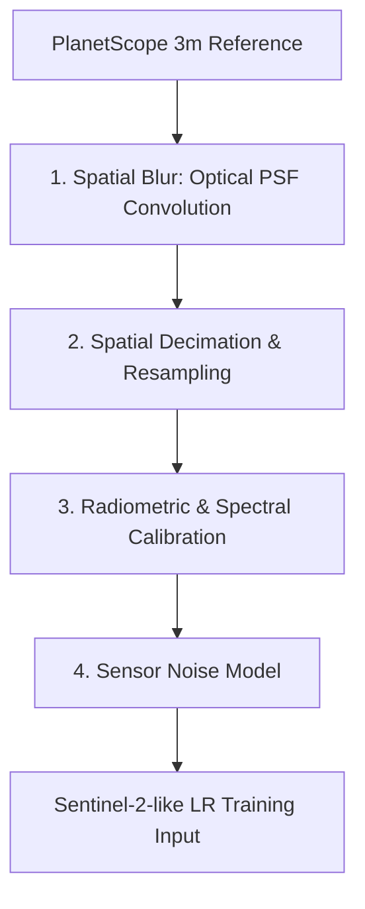

# Physical Degradation Model Design: PlanetScope to Sentinel-2

To transition from synthetic validation to real-world Super-Resolution Mapping (SRM), we must replace simple bilinear downsampling with a physically motivated sensor degradation model. A naive resampling model assumes a clean, uniform grid relationship that does not exist in real satellite systems, which leads to models that overfit to interpolation artifacts and perform poorly on real data.

This document designs a physically motivated degradation pipeline to map **PlanetScope high-resolution reference (HR)** imagery to **Sentinel-2-like low-resolution (LR)** inputs.

---

## 1. Spatial Blurring: The Point Spread Function (PSF)

Every satellite sensor's optics scatter incoming light, which acts as a low-pass filter. This optical blurring is mathematically represented by the sensor's **Point Spread Function (PSF)**. Before spatial decimation (downsampling), the high-resolution PlanetScope imagery must be convolved with a spatial PSF kernel matching the target Sentinel-2 sensor characteristics.

### Mathematical Formulation
The PSF of Sentinel-2 is physically modeled as a 2D circularly symmetric Gaussian kernel:
$$H(x, y) = \frac{1}{2\pi \sigma^2} \exp\left(-\frac{x^2 + y^2}{2\sigma^2}\right)$$

Where the standard deviation $\sigma$ is linked to the sensor's **Full Width at Half Maximum (FWHM)** or the **Modulation Transfer Function (MTF)**:
$$\text{FWHM} = 2\sqrt{2\ln 2} \cdot \sigma \approx 2.3548 \cdot \sigma$$

*   For Sentinel-2 10m bands, the FWHM is approximately 1.0 to 1.3 pixels (10–13 meters at ground level).
*   In the high-resolution grid coordinate system (e.g., $dx = 2.5\text{m}$ for $K=4$), this corresponds to a spatial blur kernel with standard deviation:
    $$\sigma_{\text{HR}} = \frac{\sigma_{\text{LR}}}{dx} \approx 1.25\text{ pixels}$$
*   **Convolution**: The PlanetScope HR scene $I_{\text{HR}}$ is convolved with the Gaussian PSF kernel $H$:
    $$I_{\text{blurred}} = I_{\text{HR}} * H$$
    *Note*: Convolution must be performed prior to decimation to prevent aliasing (high-frequency folding).

---

## 2. Spatial Decimation & Resampling

After convolving with the PSF to remove high-frequency details that the low-resolution sensor cannot resolve, the blurred image is decimated (downsampled) to the Sentinel-2 grid resolution.

*   **Grid Snapping**: Rather than arbitrary resampling, the downsampling grid is snapped to the coordinate system of the Sentinel-2 image using the geotransform:
    $$X_{\text{LR}} = X_{\text{S2\_origin}} + i \cdot dx_{\text{S2}}, \quad Y_{\text{LR}} = Y_{\text{S2\_origin}} + j \cdot dy_{\text{S2}}$$
*   **Resampling Method**: Area-weighted averaging or bilinear decimation is applied on the blurred HR pixels to compute the corresponding LR pixel value, representing the integration of radiance over the low-resolution sensor's Instantaneous Field of View (IFOV).

---

## 3. Spectral Response Functions (SRF) Discrepancies

PlanetScope and Sentinel-2 sensors have differing **Spectral Response Functions (SRF)**, meaning they detect photons with slightly different sensitivities across wavelengths, even for bands covering the same spectral regions (e.g., Red or NIR).

### Band-by-Band Calibration
To ensure the model learns spatial upscaling rather than correcting sensor calibration differences, the spectral reflectance values of PlanetScope ($R_{\text{Planet}}$) must be calibrated to match the Sentinel-2 L2A BOA reflectance ($R_{\text{S2}}$) range. This is achieved using a linear calibration regression over stable ground targets (e.g., asphalt, deep water, dense vegetation):
$$R_{\text{S2\_equivalent}} = \alpha \cdot R_{\text{Planet}} + \beta$$

*   **Stable Target Normalization**: Standard calibration constants ($\alpha, \beta$) are computed by matching the histograms of the overlapping coregistered scenes (excluding clouds and shadows).
*   *Without this calibration, the network would modify the radiometry of the Sentinel-2 inputs to match PlanetScope, corrupting downstream index calculations (like NDVI).*

---

## 4. Sensor Noise Model

Real Sentinel-2 imagery contains instrument noise (dark current, photon shot noise, quantization noise). A direct downsampled PlanetScope image would be unrealistically clean, causing the neural network to overfit to noise-free inputs.

*   **Additive White Gaussian Noise (AWGN)**:
    $$I_{\text{LR\_input}} = I_{\text{decimated}} + \eta, \quad \eta \sim \mathcal{N}(0, \sigma_{\text{noise}}^2)$$
    Where $\sigma_{\text{noise}}$ is estimated from homogeneous areas of the Sentinel-2 scene (typically $\sigma_{\text{noise}} \approx 0.005$ in reflectance units).
*   **Quantization**: The final degraded LR input is clipped to `[0.0, 1.0]` and scaled to match the quantization level of Sentinel-2 (e.g., 12-bit dynamic range packed in uint16).

---

## 5. Registration and Temporal Uncertainties

*   **Sub-Pixel Shift Registration**: Even after georeferenced snapped grid alignment, residual orthorectification offsets of 1–3 meters remain due to differing elevation models used by Planet and ESA. During training, the loss function (MSE) must incorporate a spatial registration tolerance (e.g., structural similarity SSIM or localized coordinate search window offset) to prevent the network from penalizing sub-pixel misalignment.
*   **Temporal Mismatch**: Moving clouds, transient shadows, soil moisture changes, and seasonal vegetation differences between the PlanetScope and Sentinel-2 passes add physical discrepancies. The training pipeline must automatically mask out high-temporal-variance areas (like active construction or agricultural harvesting) using an absolute difference threshold filter before calculating model loss.
