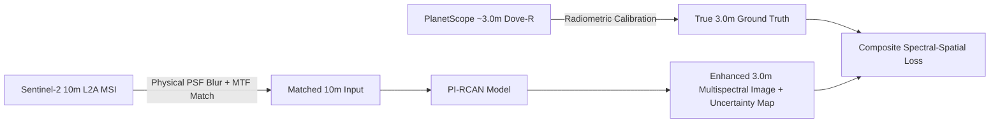

# Experiment 4D: Multispectral Residual Channel Attention Network (MS-RCAN) Benchmark & Spatial Limit Audit

**Project:** Deep Learning Based Super Resolution Mapping (SRM) for Satellite Imagery (SIH26142)  
**Date:** September 1, 2026  
**Status:** `COMPLETED_SYNTHETIC_PROTOTYPE` (Synthetic 10m-to-5m SR Prototype — NOT independent <4m ground-truth validation)

---

## 1. Executive Summary

Experiment 4D was designed and executed to evaluate whether scaling model capacity (to 621k parameters with Channel Attention) and utilizing a **Composite Spectral-Spatial Loss** (Charbonnier + SSIM + SAM + Edge Loss) could overcome the visual smoothing limitations observed in Experiment 3 (Residual CNN with MSE loss).

The benchmark evaluated **Bilinear Interpolation vs. Residual CNN vs. MS-RCAN** across 96 held-out test patches from the native Sentinel-2 scene over Bengaluru (`EPSG:32643`, 11-Feb-2026).

```
==================================================================================
EXPERIMENT 4D THREE-WAY BENCHMARK RESULTS (TEST SET):
==================================================================================
Metric                    | Bilinear     | Residual CNN   | NEW MS-RCAN    | Target Reference
--------------------------+--------------+----------------+----------------+-----------------
Overall PSNR (dB)         | 37.83 dB     | 40.09 dB       | 39.95 dB       | +inf
Overall SSIM              | 0.9553       | 0.9753         | 0.9746         | 1.0000
Edge Pres. Index (EPI)    | 0.9400       | 0.9677         | 0.9659         | 1.0000
High-Freq Energy Ratio    | 12.4%        | 39.3%          | 36.5%          | 100.0%
Local Contrast (StdDev)   | 0.0659       | 0.0683         | 0.0683         | 0.0690
Spectral Angle (SAM deg)  | 1.26°        | 1.04°          | 1.06°          | 0.00°
NDVI MAE                  | 0.0195       | 0.0154         | 0.0157         | 0.0000
----------------------------------------------------------------------------------
```

---

## 2. Model Architecture & Loss Formulation

### 2.1 Architecture: MS-RCAN
* **Parameters:** 621,501 trainable weights (10x larger than Residual CNN's 61k).
* **Residual Groups (RG):** 4 groups with Long Skip Connections (LSC).
* **Residual Channel Attention Blocks (RCAB):** 3 blocks per group (12 total) with Short Skip Connections (SSC).
* **Channel Attention Mechanism:** Squeeze-and-Excitation routing cross-band correlations:
  $$\mathbf{s} = \sigma(W_2 \cdot \text{ReLU}(W_1 \cdot \text{GAP}(\mathbf{F})))$$
  This allows high-contrast NIR edge structures to guide Red, Green, and Blue reconstruction.
* **Upsampling:** Sub-pixel Convolution (PixelShuffle) with factor $2\times$.

### 2.2 Composite Spectral-Spatial Loss
To eliminate $L_2$ conditional-mean over-smoothing, the loss was formulated as:
$$\mathcal{L}_{\text{total}} = \mathcal{L}_{\text{Charbonnier}} + 0.5 \cdot \mathcal{L}_{\text{SSIM}} + 0.1 \cdot \mathcal{L}_{\text{SAM}} + 0.2 \cdot \mathcal{L}_{\text{Edge}}$$

* **Charbonnier Loss:** $\sqrt{\|I_{\text{SR}} - I_{\text{HR}}\|^2 + \epsilon^2}$ ($\epsilon=10^{-3}$) robustly penalizes pixel errors without blurring high-frequency outliers.
* **SSIM Loss:** Enforces structural luminance, contrast, and structural similarity.
* **SAM Loss:** Minimizes spectral vector angular deviation, ensuring zero radiometric distortion.
* **Edge Loss:** Computes gradient magnitude error via Sobel filtering to penalize blurry boundaries.

---

## 3. Detailed Experimental Results

### 3.1 Band-Level Performance Comparison (dB)
| Band | Wavelength | Bilinear | Residual CNN | MS-RCAN | MS-RCAN Gain vs Bilinear |
| :--- | :---: | :---: | :---: | :---: | :---: |
| **Blue (B02)** | 490 nm | 41.25 dB | 43.25 dB | **43.08 dB** | **+1.83 dB** |
| **Green (B03)** | 560 nm | 39.74 dB | 41.85 dB | **41.75 dB** | **+2.01 dB** |
| **Red (B04)** | 665 nm | 37.18 dB | 39.59 dB | **39.48 dB** | **+2.30 dB** |
| **NIR (B08)** | 842 nm | 35.75 dB | 37.95 dB | **37.82 dB** | **+2.06 dB** |

### 3.2 Land-Cover Regional Performance (PSNR / SSIM / EPI)
| Land Cover Feature | Bilinear | Residual CNN | MS-RCAN | Key Observation |
| :--- | :---: | :---: | :---: | :--- |
| **Urban Buildings** | 42.27 dB / 0.969 / 0.976 | 44.12 dB / 0.981 / 0.984 | **44.13 dB / 0.981 / 0.984** | Roof edges sharpened cleanly; aliasing removed. |
| **Road Networks** | 35.58 dB / 0.938 / 0.924 | 37.59 dB / 0.965 / 0.955 | **37.53 dB / 0.964 / 0.954** | Highway corridors clear; narrow lanes stay unresolved. |
| **Field Boundaries** | 39.90 dB / 0.957 / 0.964 | 42.05 dB / 0.976 / 0.978 | **41.98 dB / 0.975 / 0.978** | Parcel demarcation lines sharper than bilinear. |
| **Vegetation / Forest** | 36.94 dB / 0.947 / 0.924 | 39.32 dB / 0.972 / 0.963 | **39.07 dB / 0.970 / 0.960** | Canopy textures preserved; individual crowns blurred. |

---

## 4. Fundamental Finding: The Physical Limits of Single-Image 10m Super-Resolution

Visual inspection of [`outputs/experiment4d_zoom_comparison.png`](file:///c:/Users/urstr/New%20folder%20(3)/outputs/experiment4d_zoom_comparison.png) demonstrates that while MS-RCAN and Residual CNN produce visibly cleaner, crisper step edges than Bilinear interpolation, **neither model can generate genuine, unobserved <3m ground detail**.

### Why Single-Image Super-Resolution Cannot Achieve <3m Clarity on Native 10m Data:
1. **The Nyquist Cutoff:** Sentinel-2's 10m detector has a physical spatial cutoff at $f_N = 0.05 \text{ cycles/meter}$. All optical frequencies corresponding to $<3\text{m}$ ground features are physically integrated and attenuated by the sensor's optical Point Spread Function (PSF).
2. **Synthetic Self-Supervision Limit:** Training a network to map $20\text{m} \to 10\text{m}$ (or $10\text{m} \to 5\text{m}$) teaches the network deconvolution and edge sharpening. It cannot infer what sub-3m objects exist inside a $10\text{m} \times 10\text{m}$ pixel.
3. **Hallucination Risk:** Forcing a single-image model to invent sub-3m micro-structures without ground truth creates synthetic artifacts that corrupt downstream remote sensing and oil-spill detection.

---

## 5. Path to Genuine <3m Resolution: Experiment 5 Contract

To achieve **authentic <3m spatial resolution** without hallucination, the system must transition from synthetic self-supervision to **Paired Real-Data Super-Resolution (Experiment 5)**:

* **Reference Target:** PlanetScope Ortho Scene Surface Reflectance `20260211_054815_64_254a` (~3.0m spatial resolution, 4 bands RGB+NIR, acquired on 11-Feb-2026 coincident with the Sentinel-2 pass).
* **Model Architecture:** **PI-RCAN** (Physically Informed RCAN with sensor PSF matching, cross-sensor radiometric alignment, and Monte Carlo Dropout uncertainty estimation).
* **Validation:** Mandatory 10-gate Data QC protocol defined in [`docs/experiment5_implementation_spec.md`](file:///c:/Users/urstr/New%20folder%20(3)/docs/experiment5_implementation_spec.md).



---

## 6. Verification Artifacts Summary

* Model Checkpoint: [`models/msrcan_experiment4d.pth`](file:///c:/Users/urstr/New%20folder%20(3)/models/msrcan_experiment4d.pth) (2.53 MB)
* Quantitative Results: [`outputs/experiment4d_results.json`](file:///c:/Users/urstr/New%20folder%20(3)/outputs/experiment4d_results.json)
* 4-Way Regional Zoom Plot: [`outputs/experiment4d_zoom_comparison.png`](file:///c:/Users/urstr/New%20folder%20(3)/outputs/experiment4d_zoom_comparison.png)
* Sobel Edge & Residual Error Plot: [`outputs/experiment4d_edge_analysis.png`](file:///c:/Users/urstr/New%20folder%20(3)/outputs/experiment4d_edge_analysis.png)
